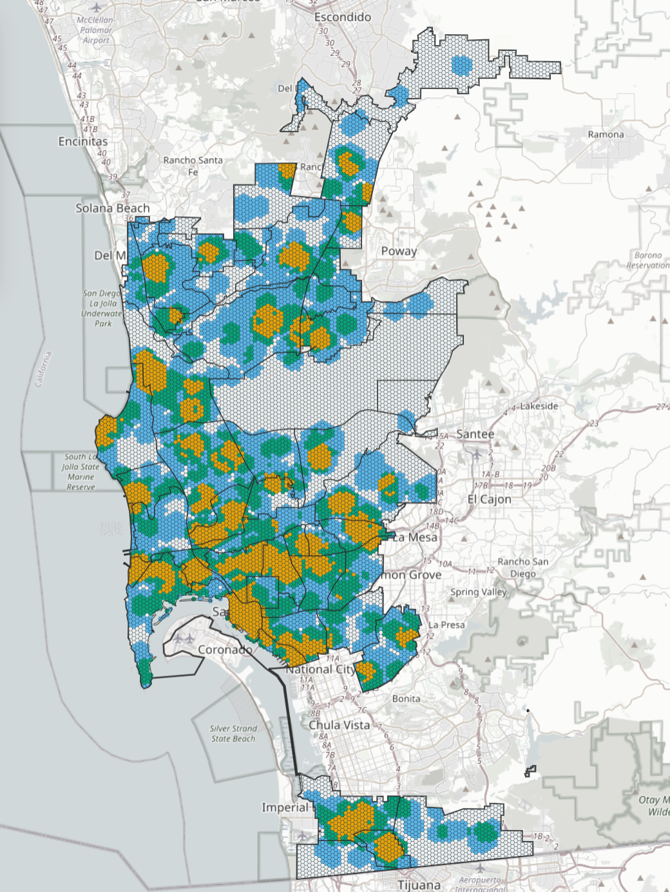

# walkSD 🚶


Live app: [https://bmarkman1234.github.io/walkSD/](https://bmarkman1234.github.io/walkSD/)



walkSD is an interactive San Diego walkability map with two selection modes:
- Hex-level exploration
- Community-level summary

## Quick Start

1. Open the live app link above.
2. Choose a metric in **Color By**.
3. Pick a **Click Mode** (`Hex` or `Community`).
4. Click on the map to inspect values.

## Controls

### Color By

Switch the hex color ramp between:
- Combined Score
- Grocery/Convenience Count
- Park Count
- Library Count

### Click Mode

- **Hex mode**
  - Click a hex to open a popup.
  - The selected hex is highlighted (flashing outline).
  - Community boundaries are **not** highlighted in Hex mode.

- **Community mode**
  - Click a community to open a popup.
  - The selected community boundary is highlighted (flashing outline).

## What You See When Clicking

### Hex click (Hex mode)

Popup shows:
- Hex ID
- Community Plan
- Combined Score
- Grocery/Convenience Count
- Park Count
- Library Count

### Community click (Community mode)

Popup shows:
- Community
- Hexes
- Average Score
- Total Grocery/Convenience
- Total Parks
- Total Libraries

## How Community Totals Are Calculated

- `Hexes`: number of hexes whose centroids fall inside the selected community.
- `Average Score`: average of hex `score` values for those hexes.
- `Total Grocery/Convenience`, `Total Parks`, `Total Libraries`: raw asset point counts inside the selected community polygon (not score sums).

## Scoring Logic (Combined Score)

Each hex gets 0 to 3 points:
- +1 if at least one grocery/convenience location is within 800m
- +1 if at least one park is within 800m
- +1 if at least one library is within 1200m

## Run Locally

From the project folder:

```powershell
python -m http.server 8000
```

Then open:

`http://localhost:8000/`

Optional helper script (`run-local.ps1`):

```powershell
Set-Location "C:\Users\bmark\OneDrive\Documents\Github\SD_Walkability"
python -m http.server 8000
```
